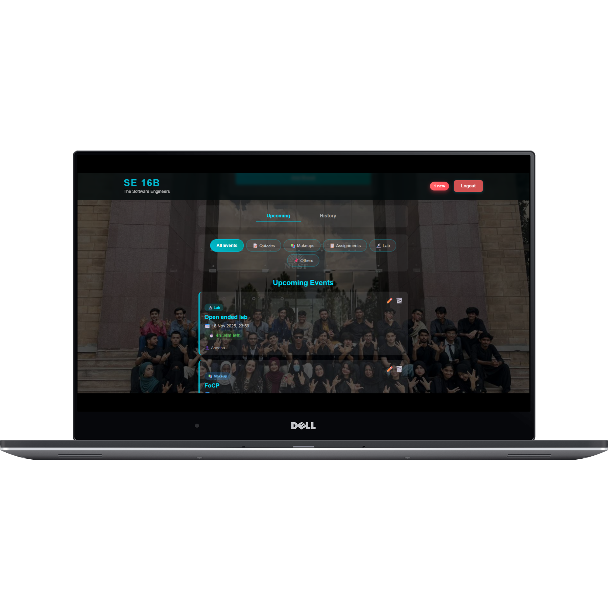
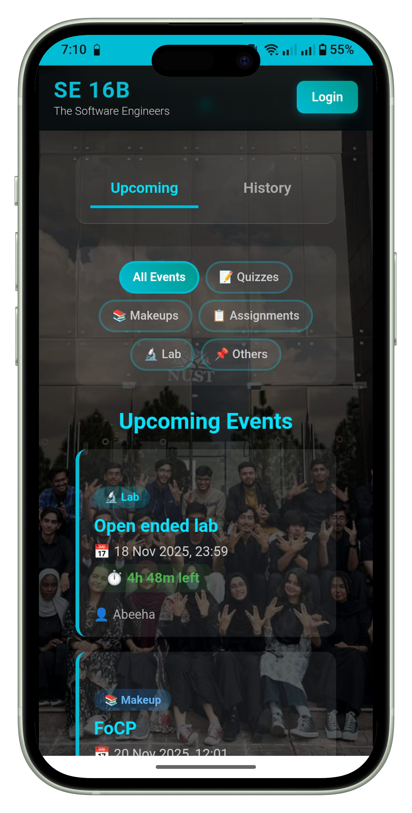
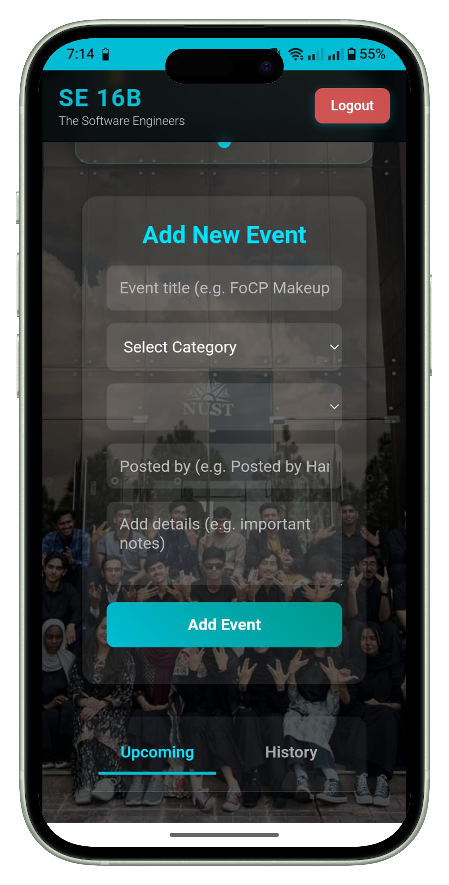
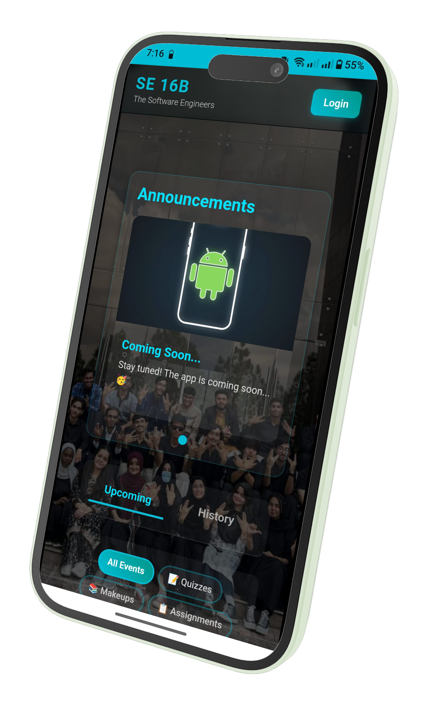

# 🎓 SE-16B Class Scheduler & Organizer

> A centralized, real-time dashboard for the **SE-16B** class to manage schedules, assignments, announcements, makeups and more.

## 💡 Overview
This Progressive Web App (PWA) serves as the digital notice board for our class. It replaces scattered WhatsApp messages with a single, organized hub. It features a **student view** for checking deadlines and an **admin dashboard** for class representatives to post updates.

## 📸 User Interface

### 💻 Desktop View
> The dashboard automatically adapts to wide screens, giving a complete overview of the schedule.



### 📱 Mobile View (PWA)
> Optimized for touch interactions. Students can install this as a native app and can be installed on iOS as well.

| Student Home | Admin Panel | Announcement Carousel |
|:---:|:---:|:---:|
|  |  |  |

## ✨ Key Features

### 📅 Intelligent Scheduling
* **Smart Sorting:** Events are automatically categorized (Quiz, Lab, Assignment, Makeup).
* **Urgency Logic:** Events entering their final hour get a glowing **"⚠️ LAST HOUR!"** badge.
* **Auto-Cleanup:** The events for which the deadline is reached are moved to the **History** tab and then the system automatically deletes events that are more than **24 hours old** to keep the dashboard clutter-free.
* **Countdown Timers:** Real-time countdowns for every upcoming submission or class.

### 📢 Announcement Carousel
* **Visual Updates:** Auto slideshow for announcements.
* **Image Hosting:** Integrated with **ImgBB API** to handle image uploads directly from the browser.
* **Touch Support:** Swipe-enabled carousel for mobile users.

### 🛡️ Admin Panel
* **Secure Login:** Firebase Authentication for authorized admins (CR/GR).
* **CRUD Operations:** Admins can Create, Read, Update, and Delete events and announcements directly from the UI.
* **Toast Notifications:** custom notification banner for successful actions.

## 🛠️ Tech Stack

| Component | Technology |
| :--- | :--- |
| **Frontend** | HTML5, CSS3, Vanilla JavaScript (ES6+) |
| **Backend** | Firebase Firestore (NoSQL Database) |
| **Auth** | Firebase Authentication |
| **Storage** | ImgBB API (for Announcement Images) |
| **Hosting** | Github Hosting |

## 📂 Project Structure

```text
SE_16B_ClassOrganizer/
├── index.html          # Main UI structure
├── style.css           # Custom styling & responsive design
├── script.js           # Core logic (Firebase connection, UI Controller)
├── manifest.json       # PWA configuration
├── firebase.json       # Hosting rules
└── README.md           # Documentation